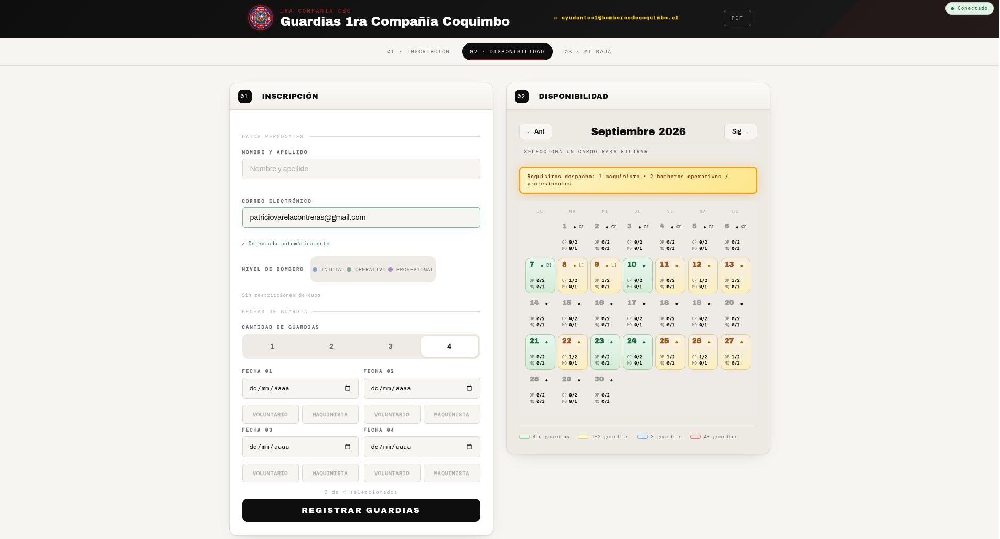
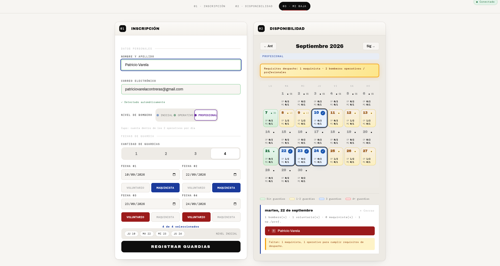
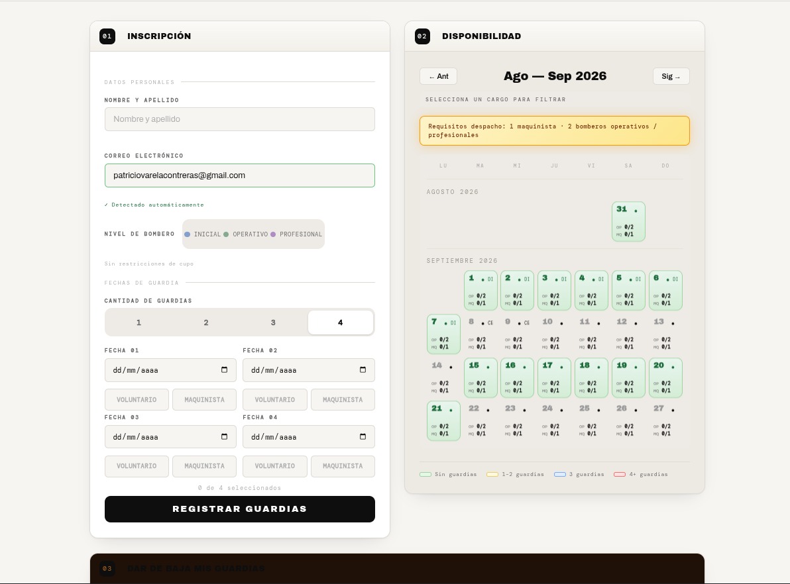
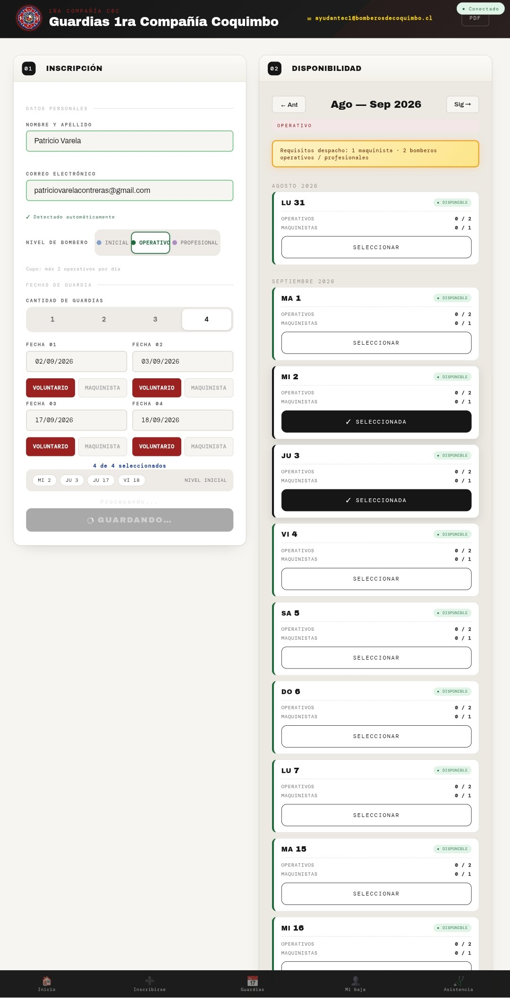
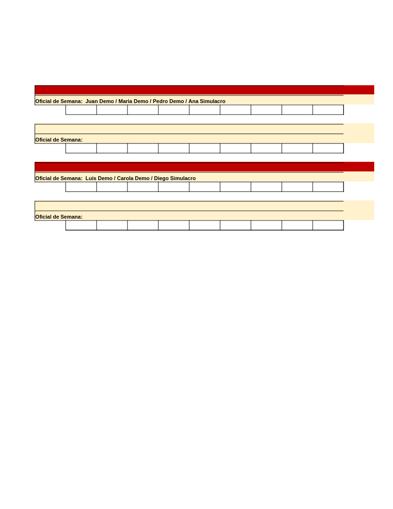
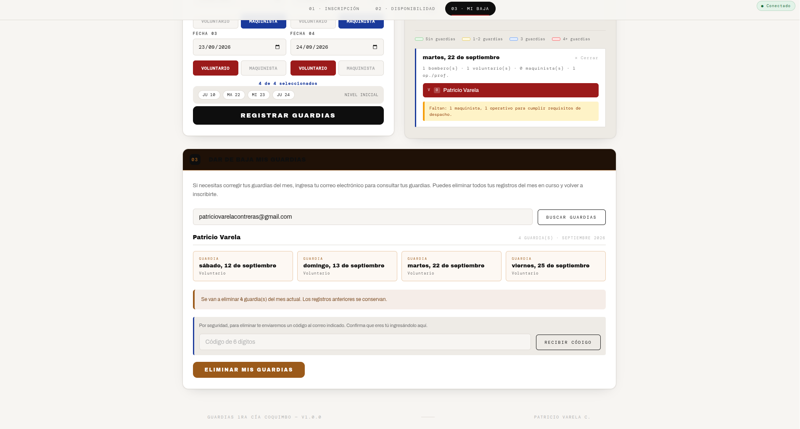
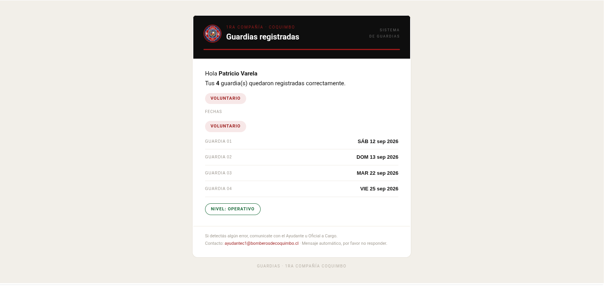
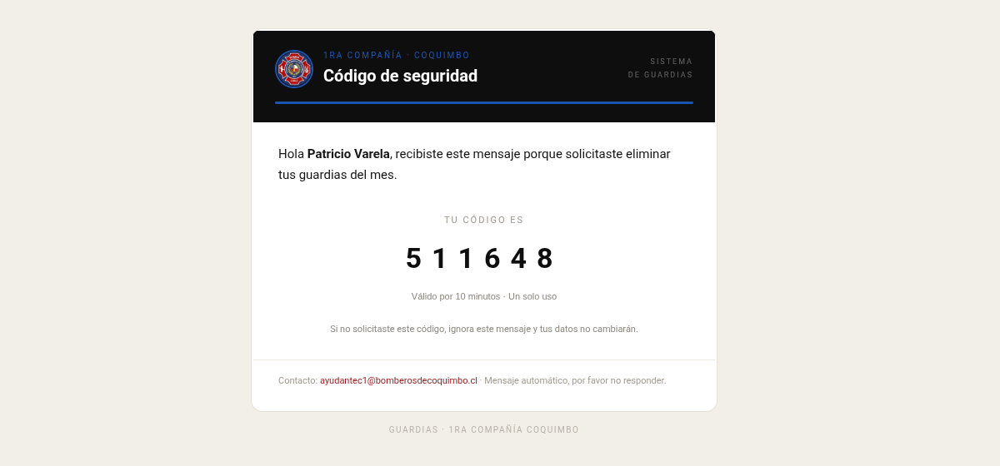

# Sistema de Guardias — 1ª Compañía de Bomberos del CBC

Sistema de calendarización y gestión de guardias para la 1ª Compañía del Cuerpo de Bomberos de Coquimbo. Construido sobre **Google Apps Script** (backend + web app) con **Google Sheets** como base de datos.

> **Estado:** Producción estable · v1.1.0 · [Ver demo](https://2674321.github.io/sistema-de-guardias/demo/)

## Demo en línea (datos ficticios)

El repositorio publica una **demo autónoma y desacoplada** del backend real en GitHub Pages:

- **Landing:** https://2674321.github.io/sistema-de-guardias/
- **Demo interactiva:** https://2674321.github.io/sistema-de-guardias/demo/

La demo (`docs/demo/`) es una copia de la interfaz con **datos ficticios**, sin `google.script.run` ni acceso a ninguna hoja real: no modifica guardias, no envía correos y no toca la base de datos de producción. Sirve únicamente para mostrar la experiencia de usuario.

## Capturas de pantalla

### Ventana principal


### Página principal con inscripciones


### Calendario bimestral — Escritorio


### Calendario bimestral — Móvil


### Hoja de guardias generada (ejemplo con datos ficticios)


### Baja protegida de guardia


### Correo de días de guardia


### Correo con código de verificación


## Arquitectura

```
Web App (Index.html, SPA) ──google.script.run──► Backend Apps Script ──► Google Sheets (BD)
        │                                              │
        └── HtmlService/doGet                          └── MailApp · CacheService · LockService
                                                           PropertiesService · Triggers
```

| Capa | Archivos |
|---|---|
| Frontend | `src/Index.html` |
| Contrato calendario | `src/Código.js` (`obtenerCalendario`, contrato `cal-1`) |
| Configuración | `src/Config.gs` |
| Reglas puras | `src/Reglas.gs` |
| Acceso a datos | `src/Db.gs` |
| Seguridad (baja) | `src/Seguridad.gs` |
| Migraciones | `src/Migracion.gs` |
| Administración | `src/Admin.gs` (menú hoja) |
| Estadísticas / PDF | `src/Estadisticas.js` · `src/Exportar.js` |
| Validación baja | `src/ValidacionEliminacion.js` |
| Diagnóstico | `src/Diagnostico.gs` · `src/Tests.gs` |

## Funcionalidades

- **Guardias configurables 2/3/4** por inscripción (máximo; el voluntario elige cuántas, desde 1).
- **Niveles**: 🔵 INICIAL · 🟢 OPERATIVO · 🟣 PROFESIONAL — con cupo operativo compartido de 2/día para O+P e inicial sin restricción.
- **Calendario** mensual con estados por día (Disponible / Limitada / Completa), requisitos de despacho 1 maquinista + 2 operativos, timeline móvil y scroll horizontal seguro en desktop.
- **Asistencia** C/P/R/NC por guardia.
- **Baja protegida** con código de un solo uso enviado al correo (anti-suplantación).
- **Estadísticas** diarias/mensuales/ranking y **exportación PDF** mensual.
- **Estados de conexión** (● Conectado · ◐ Sincronizando · ⚠ Lento · ✕ Sin conexión) con fallback al último calendario válido.

## Configuración (hoja `Config`)

| Celda | Parámetro | Default |
|---|---|---|
| C3 | Primer lunes de guardia del mes | — |
| C4 | Semanas habilitadas (`0,2`) | `0,2` |
| C5 | Cantidad máxima de guardias (2·3·4) | 4 |
| C6 | Fecha límite de inscripción | sin límite |
| C7 | Días de antelación para eliminar | 3 |
| C8 | Mostrar panel Asistencia (1/0) | 0 (oculto) |

Menú ** GUARDIAS CBC** en la hoja: instalación automática del disparador la primera vez que la app corre; si no aparece, ejecutar `instalarTriggerMenuAdmin` desde el editor.

## Desarrollo local

```bash
clasp login                 # cuenta propietaria
clasp pull                  # Apps Script → repo
clasp push                  # repo → Apps Script
```

`.clasp.json` (raíz) apunta al proyecto con `rootDir: src`.

### Pruebas

```bash
node tools/local-tests/run_tests.mjs    # suite pura (69 casos)
node tools/check-funciones.mjs          # funciones llamadas vs definidas (frontend)
node tools/prueba-carga.mjs [URL]       # latencia del shell (no abusiva)
```

En Apps Script: menú → Pruebas → *Ejecutar tests*.

## Deployment

1. `clasp push`
2. `clasp deploy -i <DEPLOYMENT_ID> -d "descripción"` — re-despliega **la misma URL** en una versión nueva.

Deployment vigente (App Script v58, commit `1cd8f58`): menú **GUARDIAS CBC** → *Sistema* → *Ver URL de la app*, o el campo **About** de este repositorio.

## Versionado

SemVer (`MAJOR.MINOR.PATCH`). Para release:

```bash
git commit -m "release: vX.Y.Z …"
git tag -a vX.Y.Z -m "…"
git push origin main --follow-tags
```

Historial: [`CHANGELOG.md`](CHANGELOG.md).

## Demo vs Producción

| | Demo (`docs/demo/`) | Producción (Apps Script) |
|---|---|---|
| Datos | Ficticios, embebidos | Google Sheets real |
| Backend | Ninguno (archivos estáticos) | `google.script.run` → Apps Script |
| Guardias / asistencia | Solo lectura de ejemplo | Modifican la hoja real |
| Correos | No envía | `MailApp` (días + código) |
| Acceso | Cualquiera (GitHub Pages) | Web App con `HtmlService` |

## Datos

El repo incluye **solo datos demo anónimos** (`data/registro_guardias.csv`). Para exportar datos reales localmente:

```bash
curl -sL "https://docs.google.com/spreadsheets/d/<ID>/export?format=csv" -o data/registro_guardias-real.csv
```

(`registro_guardias-real.csv` está en `.gitignore`.)

## Licencia

Distribuido bajo la **licencia MIT**. Ver [`LICENSE`](LICENSE).

Para citar este proyecto: ver [`CITATION.cff`](CITATION.cff).
